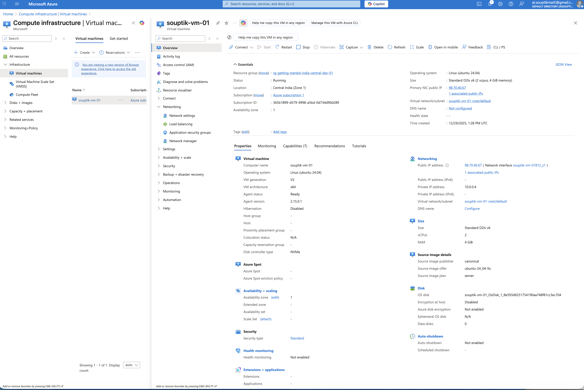
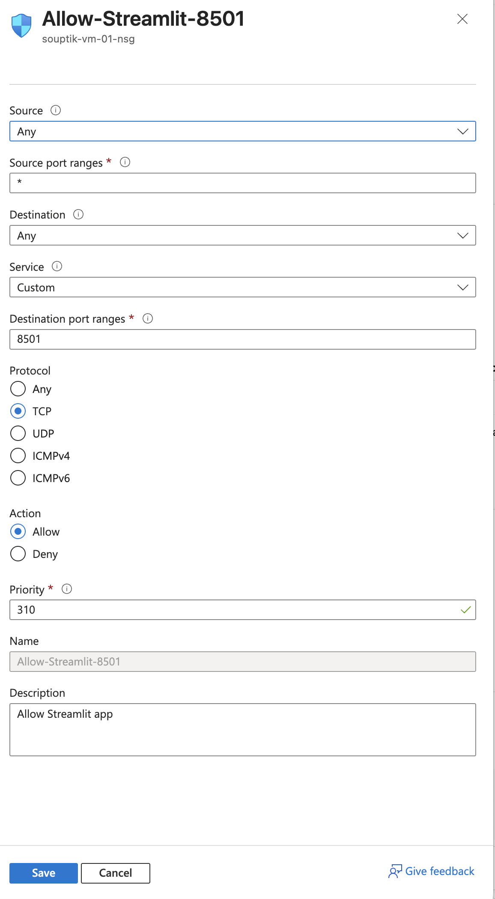

1. Azure Portal → Virtual Machines → Create
2. vm properties
   
3. ssh -i souptik-vm-01_key.pem azureuser@<AZURE_VM_PUBLIC_IP>
4. 
    # Update system
    sudo apt update -y

    # Install Docker
    sudo apt install -y docker.io

    # Start Docker
    sudo systemctl start docker
    sudo systemctl enable docker

    docker --version

    🔧 (Optional but recommended) Run Docker without sudo
    sudo usermod -aG docker azureuser
    newgrp docker

5. 
    scp -i souptik-vm-01_key.pem -r ./streamlit-intro azureuser@98.70.40.67:/home/azureuser/
    cd streamlit-intro
    docker build -t streamlit-app .
    docker run -d \
        -p 8501:8080 \
        --name streamlit-app \
        streamlit-azure

    docker stop streamlit-app
    docker start streamlit-app
    sudo systemctl stop docker

6.  open 8501 port in vm
      

7. http://<AZURE_VM_PUBLIC_IP>:8501

💰 Cost awareness (IMPORTANT)
Azure VM runs 24/7 unless stopped.
Stop VM when not needed
Azure Portal → VM → Stop
